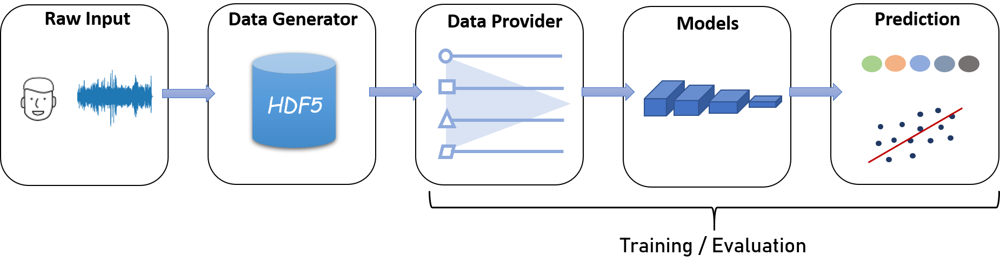

# End2You - The Imperial Toolkit for Multimodal Profiling

We introduce End2You the Imperial toolkit for multimodal profiling. This repository provides easy-to-use scripts to train and evaluate either unimodal or multimodal models in an end-to-end manner for either regression or classification output. The input to the model can be of 1D (e.g. audio, eeg, heart rate etc.), 2D (e.g. spectrogram, image etc), or 3D (e.g. video etc). The main blocks of the unimodal and multimodal models are (i) a Convolutional Neural Network (CNN) that extracts spatial features from the raw data, and (ii) a recurrent neural network (RNN) that captures the temporal information in the data. The models can be combined in any desirable way, and the user can also define new models and combine with the existing implementations.

The End2You workflow (shown below) is comprised of the data generator, that transforms the raw file format to hdf5, the data provider that feeds the data to the models, and finally, the prediction. We provide a number of audio/visual/multimodal models (see [tutorials](docs/tutorials) or [cli](docs/cli)). One can easily use its own models to train or use our pre-train models on their dataset.



### Citing

If you use End2you or any code from End2you in your research work, you are kindly asked to acknowledge the use of End2You in your publications.
> `Tzirakis, P.,Zafeiriou, S., & Schuller, B. (2017). End2You -- The Imperial Toolkit for Multimodal Profiling by End-to-End Learning. arXiv preprint arXiv:1802.01115.`

```
@article{tzirakis2018end2you,
  title={End2You--The Imperial Toolkit for Multimodal Profiling by End-to-End Learning},
  author={Tzirakis, Panagiotis and Zafeiriou, Stefanos and Schuller, Bjorn W},
  journal={arXiv preprint arXiv:1802.01115},
  year={2018}
}
```

### Challenges

End2You has been used with great success, providing strong baselines in the following challenges:

* [Interspeech Computational Paralinguistics ChallengE (ComParE) 2017, 2018](http://www.compare.openaudio.eu/)
* [EAT: Eating Analysis & Tracking Challenge 2018](https://icmi-eat.ihearu-play.eu/)
* [Multimodal Sentiment Analysis Challenge and Workshop (MuSe 2020)](https://www.muse-challenge.org/home)


## Installation

### Conda Installation

We highly recommended to use [conda](http://conda.pydata.org/miniconda.html) as your Python distribution.
Once downloading and installing [conda](http://conda.pydata.org/miniconda.html), this project can be installed by using the `conda_setup.yml` file as follows:

```console
$ conda env create -f conda_setup.yml
```

You can now activate the environment and use End2You.
```console
$ conda activate end2you
```
### Pip Installation

Another way to install End2You is via `pip` as shown below:

```console
$ pip install git+https://github.com/end2you/end2you.git
```

### Dependencies
Below are listed the required modules to run the code.

  * Python >= 3.7
  * NumPy >= 1.19.2
  * Pytorch >= 1.7 (see ``Installation`` section for installing this module)
  * MoviePy >= 1.0.3
  * sklearn >= 0.23.2
  * h5py >= 2.10.0
  * facenet-pytorch >= 2.5

<!--

### Contents

1. [Installation](#installation)<br>
2. [Generating Data](#generating-data)<br>
3. [Training](#training)<br>
4. [Testing](#testing)<br>
-->
