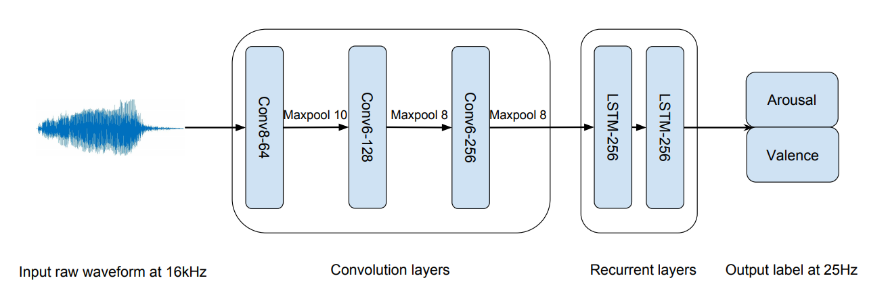
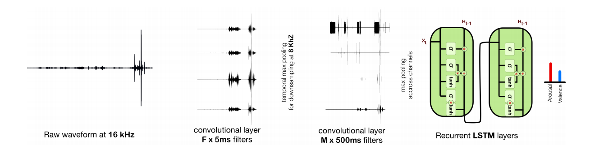

## Tutorials

We provide the following [basic](tutorials/basic) tutorials to get you started with End2You

1. [Data Generation](tutorials/basic/1.%20Data%20Generation.ipynb): Show how to generate `hdf5` files from a dataset.<br>
2. [Data Provider](tutorials/basic/2.%20Data%20Provider.ipynb): Show how to read the `hdf5` files.<br>
3. [Training Process](tutorials/basic/3.%20Training%20Process.ipynb): Show how to train a model using training/validation data.<br>
4. [Evaluation Process](tutorials/basic/4.%20Evaluation%20Process.ipynb): Show how to evaluate a model on a test set.

In addition, we provide a more [advanced example](advanced/Training.ipynb) and show how to: 
* pre-process your data using a custom method.
* use a custom network architecture.
* use a custom loss function for training or evaluation of a model.
* use a custom metric function for training or evaluation of a model.

Finally, we provide a script [file](cli) to use the command line interface.

## Pretrained Models

We provide [notebooks](pretrained_models) to train/evaluate models using standard emotion recognition databases:

* [AffWild](pretrained_models/AffWild)
* [RECOLA](pretrained_models/RECOLA)
* [SEWA](pretrained_models/SEWA)

Pre-trained models are also provided using the unimodal/multimodal models in End2You (constantly updating).

## Models

We provide a number of audio, visual and multimodal models. To get the models you need to define the `model_name` argument to be one of the modality names (See [Training Process](tutorials/3.%20Training%20Process.ipynb)).
For example, for audio modality and using Emo18 one can define the model as follows:

```python
from end2you.models.model_provider import get_model

model_params = {'model_name':'emo18', 'input_size':640, 'num_outs':3}
audio_model = get_model('audio', **model_params)
```

### Audio

We provide two models that can handle the audio modality. Both of them are papers published in ICASSP.

#### Emo18

The first one was published in 2018 and its architecture is shown below:

> `Tzirakis, P., Zhang, J., & Schuller, B. W. (2018, April). End-to-end speech emotion recognition using deep neural networks. In 2018 IEEE International Conference on Acoustics, Speech and Signal Processing (ICASSP) (pp. 5089-5093). IEEE.`




#### Emo16

The second one was published in 2016 and its architecture is shown below:

> `Trigeorgis, G., Ringeval, F., Brueckner, R., Marchi, E., Nicolaou, M. A., Schuller, B., & Zafeiriou, S. (2016, March). Adieu features? end-to-end speech emotion recognition using a deep convolutional recurrent network. In 2016 IEEE international conference on acoustics, speech and signal processing (ICASSP) (pp. 5200-5204). IEEE..`




### Visual

For the visual modality we use the models from [`torchvision.models`](https://pytorch.org/docs/stable/torchvision/models.html) and provide the following ones:

| Model Name | Number of layers |
| :---: | :---: |
| ResNet | [18,34,50,101,152] |
| VGG | [11,13,16,19] |
| VGG_BN | [11,13,16,19] |
| DenseNet | [121,161,169,201] |
| MobileNet | - |
| ResNeXt | [32x4d, 32x8d] |
| Wide ResNet | [50, 101] |
| ShuffleNet | x[0.5, 1.0, 1.5, 2.0] |

<!--
1. ResNet - [18,34,50,101,152]
2. VGG - [11,13,16,19]
3. VGG_BN - [11,13,16,19]
4. DenseNet - [121,161,169,201]
5. MobileNet
6. ResNeXt - [32x4d, 32x8d]
7. Wide ResNet - [50, 101]
8. ShuffleNet - x[0.5, 1.0, 1.5, 2.0]
-->

The input to the models should be of the size (96x96). To get one of the aforementioned models one needs to define the `model_name` to be the name of the model with the number of layers. For example, using ResNet with 18 layers one can define the model as follows:

```model_params = {'model_name':'resnet18', 'num_outs':3}```

The user can use a pretrain model on ImageNet. For example, using DenseNet with 121 layers one can define the model as follows:

```model_params = {'model_name':'resnet18', 'num_outs':3, 'pretrained':True}```

### Multimodal

We combine the audio and visual models in a multimodal one by fusing their features and feeding them in a RNN model for the final prediction.
An example of this type of model can be found in the following paper.

> `Tzirakis, P., Trigeorgis, G., Nicolaou, M. A., Schuller, B. W., & Zafeiriou, S. (2017). End-to-end multimodal emotion recognition using deep neural networks. IEEE Journal of Selected Topics in Signal Processing, 11(8), 1301-1309.`


